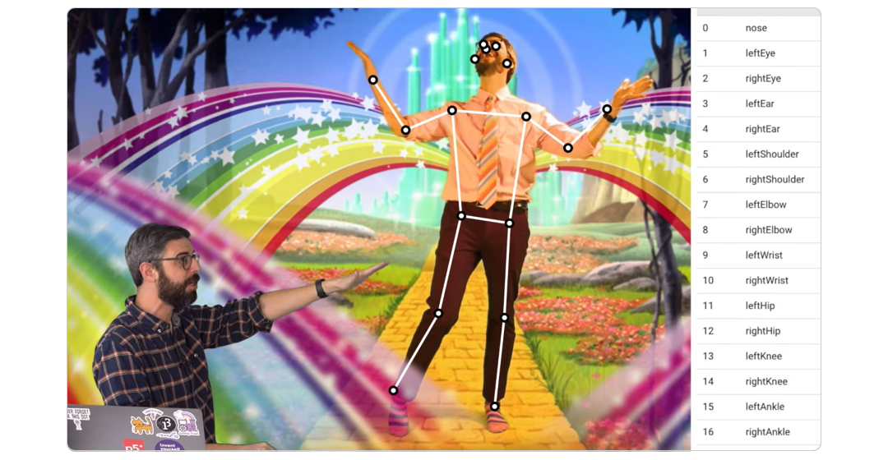
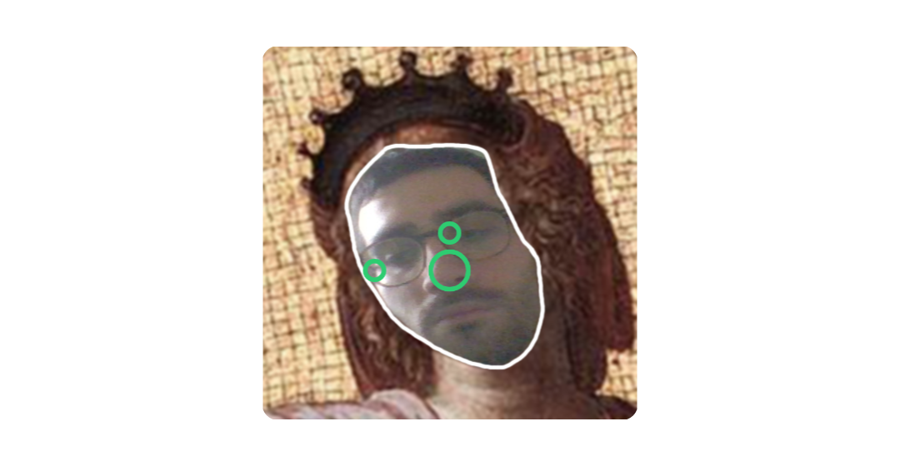
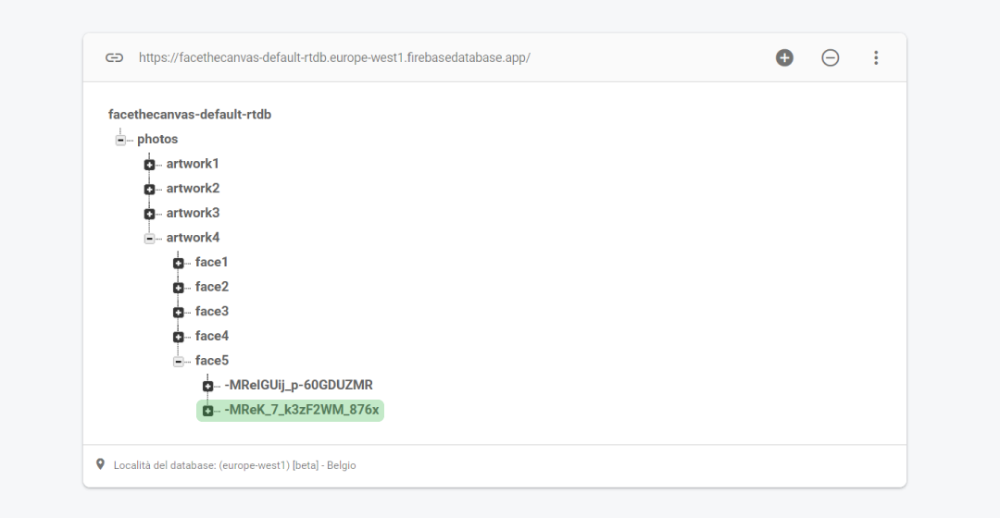

# Face the Canvas!

## Design challenges
One of our design challenges was finding a way to help the users to place their face in the right position. For this task, we use PoseNet. This tool allows a complete Pose Estimation. PoseNet is a pre-trained model, available with the ml5.js library and the p5.js library, that track the body in the browser in real time. Thus, we have a series of sets of coordinates, which can be used for our purposes.



The Coding Train - ml5.js Pose Estimation with PoseNet
https://www.youtube.com/watch?v=OIo-DIOkNVg&t=17s

We suggest the user to match his eyes and nose with some circles, that represent the correct positions for the nose and the eyes in that specific part of the canvas. The circles change their color, from red to green, when the distance between the user's eye or nose is close enough to the correct position.


## Code Challenges
This project needs a huge quantity of images and data. For this purpose, we organized a hierarchical set of folders, for the images we have prepared, different types of artworks’ cutouts, and we have used some JSON files, one for each artwork, able to give us all the necessary data to correctly replace the missing face in the artwork with the photograph collected, and give the right help to the users in the PoseNet estimation. For each face we collect the following data set:
```
{
   "positionX" : 0.413,
   "positionY" : 0.135,
   "rightEyeX" : 0.546,
   "rightEyeY" : 0.334,
   "leftEyeX" : 0.686,
   "leftEyeY" : 0.338,
   "noseX" : 0.638,
   "noseY" : 0.440
}
```
The decimal number is equal to the x or y percentage value, in reference to the width or height of the canvas.
```
(data.faces[1].positionX)*width, (data.faces[1].positionY)*height
```
The same logic is applied for the eyes and the nose, to set the correct positions in the camera and guide the user in the photo collection phase, as we saw.

The photos we collect and spread are managed through a Firebase Realtime Database. The Camera page sends the collected photos to the database, archiving them according to the organization shown below:



The photos collected are then shown in the artworks' pages. As we see in the green selection, for each face only the latest photo collected in Firebase database is shown the artwork's pages. This guarantees the site to remain constantly usable by users, who can re-update the photographs by interacting with the site. Another challenge was to understand how to spread the images files, to collect them and take them from the database. We used the Base64 Encoding.

The Coding Train - 2.6 Saving Images and Base64 Encoding - Working with Data and APIs in JavaScript
https://www.youtube.com/watch?v=9Rhsb3GU2Iw

## The Team
Fabrizio Confortola, Valentina Pippia, Sofia Serdar, Filippo Tortelli

Creative Coding a.a.2020/2021 - https://drawwithcode.github.io/2020/       
Politecnico di Milano - Scuola del Design     
Faculty: Michele Mauri, Tommaso Elli, Andrea Benedetti
